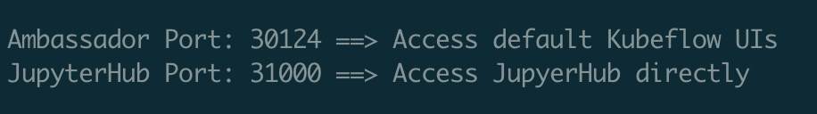
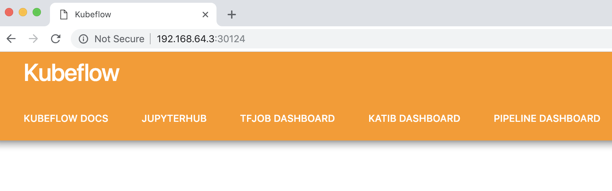

# kubeflow-tools

Simple scripts and instructions for getting the most out of your kubeflow cluster. Use kubernetes-tools to setup and manage Kubernetes using Microk8s or Charmed Kubernetes.

## Common Usage

After installing kubernetes (e.g. using [kubernetes-tools](https://github.com/canonical-labs/kubernetes-tools)), you can use this repo to install Kubeflow. Here's a simple example:

```
git clone https://github.com/canonical-labs/kubeflow-tools
cd kubeflow-tools
./install-kubeflow.sh
```

`install-kubeflow.sh` will install any necessary tools, download kubeflow, etc. It is mostly idempotent and can be run multiple times. Look inside the script for how you can further customize (compose) Kubeflow.

At the end of the install you can access the Kubeflow UI through the ambassador port. Here's an example of the output at the end of the install, and a screenshot of the URL. This happens to be done through a VM created by Multipass.



From there you can go to your browser and enter the IP address of the machine you install kubernetes on, with the Ambassador Port (ie 30105) and you will be presented with something like this:


